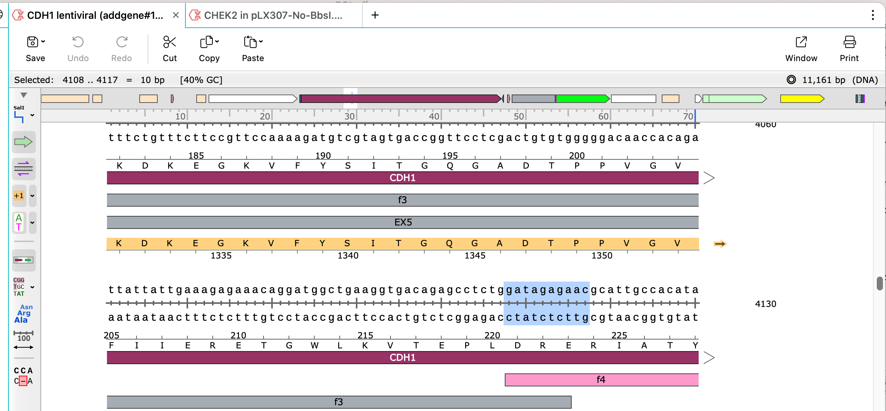
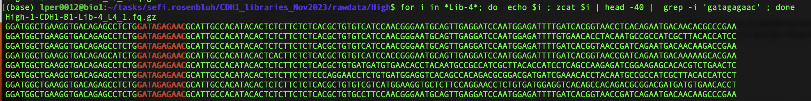

# SNV Counter

### Dependecies

To run this code you will need the following programs:   

 - [fastx tool kit](https://biocontainer-doc.readthedocs.io/en/latest/source/fastx_toolkit/fastx_toolkit.html)    
 - [bowtie2](https://bowtie-bio.sourceforge.net/bowtie2/manual.shtml)    
 - [samtools](https://www.htslib.org/)   
 - [feature counts](https://github.com/ShiLab-Bioinformatics/subread)    


### Conda environment

Set up a conda environment 

```
conda create --name SNVcounter
conda activate SNVcounter
  conda install fastx_toolkit
  conda install bioconda::bowtie2
  conda install bioconda::samtools
  conda install bioconda::subread
```

### Reference Files

Create bowtie2 indexes

```
cd libReference

    for i in *fasta
      do
           name=$(basename ${i})
           name=$(echo $name| sed -r 's/.fasta//g')
           bowtie2-build $i $name
      done
```


Create SAF files

```
for fasta in *fasta
do
  name=$(basename ${fasta})
  name=$(echo $name| sed -r 's/.fasta//g')
  samtools faidx $fasta
  awk 'BEGIN {FS="\t"}; {print $1 FS $1 FS "1" FS $2 FS "."}' $fasta.fai | awk 'BEGIN{print "GeneID" FS "Chr"	FS "Start"	FS "End" FS	"Strand"}1' > $name.SAF
done
```

### TRIMMING

trim the data. Write a specific trimming command to obtain the specific length of the fragment. Use the vector file to make sure the sequenced data doesn't include any additional sequence from the vector construct that is not the candidate fragment.

See the following example. The fragment starts with `'gatagagaac'` and in the sequencing fastq file there is a starting sequence of 28 nucleotides.




```
for i in *Lib-4*; do  echo $i ; zcat $i | head |  grep -i 'gatagagaac' ; done
```



The trimming required: `GGATGGCTGAAGGTGACAGAGCCTCTG` 

```
mkdir trimmed
cd trimmed/
source fastx_trimmer_commands.sh
cd ..

```

### MAPPING


```
mkdir map_count
cd map_count

refpath="$PWD/libReference"


for i in ../trimmed_fastq/*1_trimmed.fastq
 do
     name=$(basename ${i})
     name=$(echo $name| sed -r 's/_1_trimmed.fastq//g')
     R1=${i}
     R2=$(echo $i| sed -r 's/1_trimmed.fastq/2_trimmed.fastq/g')
     reference=$(echo $i| sed -r 's/.+(Lib-[0-9]{1,2}).+/\1/g')
     refpath="$PWD/libReferences/"
     bowtie2 -x ${refpath}/$reference -1 $R1 -2 $R2 -N 0 --end-to-end --mp 0,0 --rdg 999,999 --rfg 999,999 -k 1 --no-mixed --no-discordant -S ${name}_alignment.sam

 done
```

### FORMATING


```
for i in ../trimmed_fastq/*1_trimmed.fastq
 do
   name=$(basename ${i})
   name=$(echo $name| sed -r 's/_1_trimmed.fastq//g')
   R1=${i}
   R2=$(echo $i| sed -r 's/1_trimmed.fastq/2_trimmed.fastq/g')
   reference=$(echo $i| sed -r 's/.+(Lib-[0-9]{1,2}).+/\1/g')
   refpath="$PWD/libReferences"
   samtools view -bS  ${name}_alignment.sam >  ${name}_alignment.bam &
 done
 ```

### COUNTING


Counting reads per variant
 
```
for i in ../trimmed_fastq/*1_trimmed.fastq
 do
   name=$(basename ${i})
   name=$(echo $name| sed -r 's/_1_trimmed.fastq//g')
   R1=${i}
   R2=$(echo $i| sed -r 's/1_trimmed.fastq/2_trimmed.fastq/g')
   reference=$(echo $i| sed -r 's/.+(Lib-[0-9]{1,2}).+/\1/g')
   refpath="$PWD/libReferences"
   featureCounts -F SAF -a ${refpath}/${reference}.SAF -p  --primary  -o ${name}_featureCounts.txt  ${name}_alignment.bam &
 done
 ```


